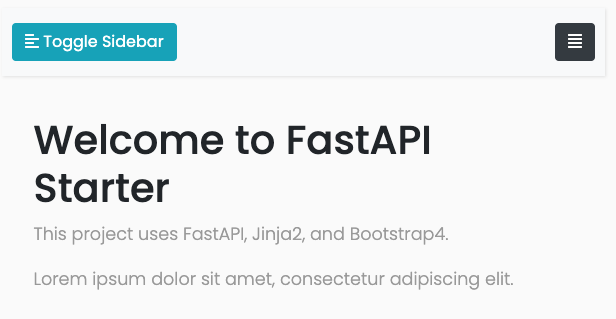

# Fastapi Web Starter


## Overview


See requirements.txt for updates.

```sh
requests==2.27.1
fastapi==0.72.0
uvicorn==0.17.0
python-dotenv==0.19.2
aiofiles==0.8.0
python-multipart==0.0.5
jinja2==3.0.3
Markdown==3.3.6
pytest==6.2.5
```

## Installation & Usage

```bash
$ git clone git@github.com:shinokada/fastapi-web-starter.git
$ cd fastapi-web-starter
# install packages
$ pip install -r requirements.txt
# start the server
$ uvicorn app.main:app --reload --port 8080
```

Visit [http://127.0.0.1:8080/](http://127.0.0.1:8080/).



## Features
